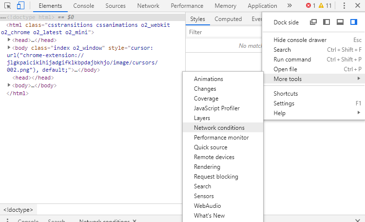
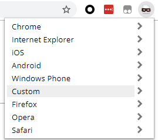
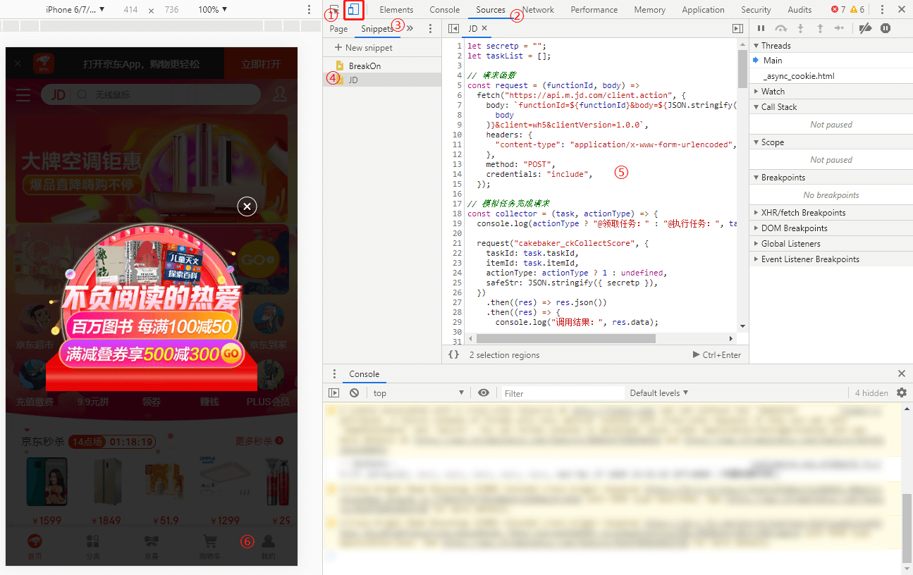
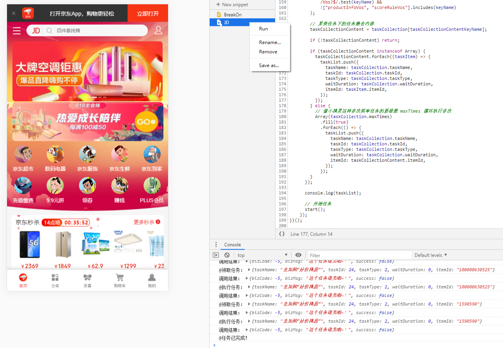

# 2020 京东 618 叠蛋糕活动

## 使用步骤

1. 建议使用 Chrome 最新版。

2. 浏览器的 User-Agent 必须包含 jdapp，如果是 Chrome 浏览器，可以使用 [User-Agent Switcher for Chrome](https://chrome.google.com/webstore/detail/user-agent-switcher-for-c/djflhoibgkdhkhhcedjiklpkjnoahfmg) 扩展进行修改。

  
  
User-Agent Switcher for Chrome 的配置

  
  
UA 切换

3. 打开浏览器，按 F12 打开开发者工具，先切换到移动设备视图（图中 ① 所示的红框按钮），接着再点击 Sources 选项卡，点击下方左边的 Snippets 选项卡（如果没有，请点击两个向右的箭头）。然后再点击 New snippet 创建一个脚本，之后把 main.js 里的内容统统粘贴进去即可。

  
  
运行步骤 1

4. 在左边的页面点击【我的】，登录京东账号。

5. 登录完成后，再右键点击脚本运行。如果任务全部完成，Console 会提示，所以请耐心等待。

  
  
运行步骤 2

6. 任务执行完成后，就可以到京东 APP 见证奇迹的时刻。

  
  
运行结果

